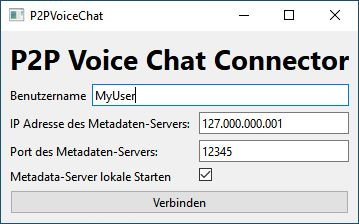
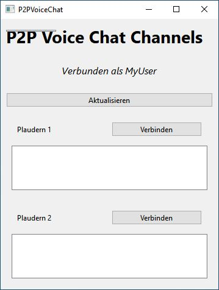
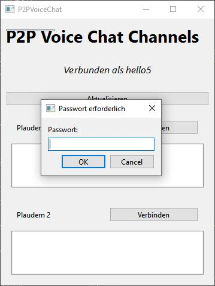

# P2P Voice Chat







Mit diesem kleinen P2P Voice Chat Programm soll eine, jedenfalls was den Austausch der Sprache selbst angeht, ein serverloses Tool im Rahmen der Vorlesung "Verteilte Systeme" entwickelt werden.
Bevor der eigentliche Aufbau bzw. die Entwicklung im Detail besprochen wird, kurz noch ein paar kleinere Anmerkungen:

- Auf dem Server können vor dem Start dessen mehrere Channel definiert werden
- Aktuell ist es möglich, dass sich zwei Clients gleichzeitig in einem Channel befinden
- Die Anzahl der Channel ist theoretisch unbegrenzt, da die Serverlast extrem gering ist.
- Der Server hat **nichts** mit dem Austausch der Voice-Pakete zu tun!

## Projektkontext

- _Entwicklungszeit_: ca. 35h, ähnlich der Schätzung aus der Vorlesung
  - Die 35h setzen sich in etwa zusammen aus 5-6h Recherche, der Rest war die Einarbeitung in das Framework Qt und die Realisierung der Rechercheergebnisse
- _Framework_: Da das Projekt eine GUI aufweist und **komplett** in C++ geschrieben wurde, habe ich mich für das Framework **Qt** entschieden. Es bietet neben GUI Elementen auch zahlreiche Tools für Netzwerkschnittstellen an und vereinfacht die Entwicklung in dieser hinsicht deutlich!
- _Testsystem_: Getestet wurde die Anwendung primär auf zwei Systemen mit Windows 10. Während des Tests verlief sowohl der Metadaten-Austausch als auch der Austausch der Voice-Pakete reibungslos. Beim Testen auf zwei Linux Systemen kam es, je nach Distro zu kleineren bis größeren Problemen, besonders bei der Audio-Qualität. Teilweise waren heftige Störgeräusche wahrnehmbar, was sich eventuell auf die Neuheit des Multimedia-Moduls in Qt 6 zurückführen lässt, als auch auf eventuell Probleme beim Buffering. Da die Projektzeit mit ca. 35h für eine Person bereits deutlich erreicht wurde, konnte ich auch aufgrund anderer Projekte (Bachelorarbeit...) keine weitere Zeit in das Bug-Fixing investieren :(. 

## Verwendete Tools

- Qt Creator 7.3 als IDE
- Qt 6.3 als Framework. **Bitte zum Builden Qt 6 oder höher verwenden, da ich viele der neuen Multimedia-Funktionen nutze!** 
- VS Code für alle Dokumente
- PlantUML für alle UML Diagramme

## Grober Aufbau der Anwendung

Prinzipiell ist die Anwendung in zwei Teile zerlegt:

1. Der **Client**, der den Mikrofoninput an alle ihm bekannten anderen Clients per **UDP** schickt. UDP wurde hier gewählt, da es bei Audio-Paketen prinzipiell verkraftbar ist, wenn einige **wenige** nicht, oder in der falschen Reihenfolge ankommen. Der "normale" User wird von kleinen Aussetzern normalerweise nichts mitbekommen. Des Weiteren ist UDP durch seine verbindungslose Natur **deutlich** schneller und besitzt weniger Overhead.
2. Ein **Metadatenserver**, der die Clients untereinander bekannt macht und das UDP Holepunching ermöglicht. Da für die Metadaten sowohl deren Reihenfolge wichtig ist, in der die Clients diese empfangen also die Sicherheit, dass diese ankommen, wird für den Austausch der Metadaten **TCP** genutzt. Wichtig hierbei ist, dass der Metadaten Server für alle Clients erreichbar sein muss, d.h. er darf sich z.B. nicht hinter einem NAT befinden. Die ursprüngliche Idee war eine baumartige Struktur für die Server: Jeder Client startet einen eigenen, lokalen Server und definiert einen optionalen "Upstream" Server, mitdem die Daten synchronisiert werden. Aufgrund der gesteigerten Komplexität wurde diese Idee allerdings schnell wieder verworfen.

### Protokoll zum Austausch der Metadaten

Wie in der vorherigen Sektion bereits erwähnt, wird TCP für den Austausch der Metadaten genutzt.
Die ausgetauschten Paketen besitzen immer denselben, grundlegenden Aufbau: `([AKTION] [PAYLOAD])`.
Aus der Aktion lässt sich die Stuktur der Payload ableiten, die, abhängig davon, ob der Client oder der Server die Aktion empfängt, fest vorgegeben ist.
Je nach dem, wer ein Paket mit einer bestimmten Aktion empfängt, ist die Interpretation eine andere:

| Aktion  | Interpretation des Servers  | Interpretation des Clients  | Payload vom Server | Payload vom Client |
|---|---|---|---|---|
| connect  | Ein Client möchte einem bestimmten Voice-Channel beitreten.  | Der Server hat meine Anfrage auf Beitriff bearbeitet und antwortet mit einem Status-Code. |
| identification  | Ein Client möchte sich mit einem Usernamen identifizieren.  | Der Server möche, dass ich mich mit einem Usernamen ausweise.  |
| overview  | Ein Clients fordert eine Übersicht über alle Channels an.  | Ich fordere eine Übersicht über alle Channel an.  |
| disconnect | Ein Client möchte einen Voice-Channel ordentlich verlassen. | Ich oder ein anderer Client hat einen Voice-Channel verlassen. |
| client_joined | Ein Client möchte einem Voice-Channel beitreten. | Ich oder ein anderer Client trat einem Channel bei. |
| | |
| | |

Beispielsweise ist die Payload der Aktion "connect", mit der ein Client einem bestimmten Voice-Channel beitreten kann, auf folgende Weise definiert:

```c++
struct ChannelConnectRequest
{
    QString username;
    QString channelName;
    QString password;
};
```

Das Framework Qt bietet über seine eigene Klasse `QDataStream` die Möglichkeit an, komplexere Typen wie z.B. Strings zu serialisieren und als Byte-Array in ein Socket zu schreiben.

```c++
// Serialisieren, d.h. Elemente des Requests in den Stream schreiben
// Dies würde in diesem Fall der Client tun, und den fertigen Stream
// in ein offenes TCP Socket schreiben
inline QDataStream& operator<<(QDataStream &stream, const ChannelConnectRequest& request)
{
    stream << QString("connect");
    stream << request.username << request.channelName << request.password;
    return stream;
}

// Deserialisieren, dies geschieht auf Seite des Servers in diesem Fall. 
// Der Server auf der anderen Seite kann, wenn er die Aktion "connect" liest
// die Daten wieder extrahieren.
inline QDataStream& operator>>(QDataStream &stream, ChannelConnectRequest& request)
{
    stream >> request.username >> request.channelName >> request.password;
    return stream;
}
```
## Austausch der Sprachpakete

Die Sprachpakete selbst werden über UDP ausgetauscht. Der Metadaten-Server vermittelt dabei zwischen den Clients und tauscht sowohl deren IP als auch deren Port aus.
Jeder Client hört dabei **einen** UDP-Port ab. Somit müssen, falls mehrere Clients verbunden wären und an diesen Port senden würden, die Pakete wieder voneinander getrennt werden und entsprechend zusammen abgespielt werden.
In der aktuellen Version wird deshalb bereits der Username, von dem das UDP Paket kommt, vorne an die eigentliche PCM-Payload angehangen, um dies in Zukunft zu ermöglichen.
Die Pakete werden noch **nicht** voneinander getrennt bzw. gleichzeitig abgespielt, weswegen aktuell jeder Client mit genau einem anderen Client sprechen kann.

Jeder Client besitzt, um Unregelmäßigkeiten in der Anzahl der Empfangenen Pakete zu vermeiden, einen lokalen Buffer.
Dieser Buffer - auch _Jitter Buffer_ genannt - speichert genau eine Sekunde an Voice-Daten zwischen, bevor diese an die Ausgabe übergeben werden.
Da die PCM Daten aktuell **unkomprimiert** übertragen werden, wurde die Sprachqualität entsprechend angepasst, um zu große Datenmengen zu vermeiden:

* Channels: 1 (Mono)
* Abtastrate in Hz: 4000
* Größe pro Sample: 2 Byte (16 Bit)

In Zukunft soll das sehr bekannte Encoding namens _Opus_ eingesetzt werden, was u.a. in erfolgreichen Applikationen wie z.B. Discord eingesetzt wird.
Opus ist eine Verlustbehaftete Kodierung, erreicht allerdings akzeptable Sprachqualität.

## Beispielhafter Ablauf der Identifizierung


## Beispielhafter Ablauf des Beitreten zu einem Channel (stark vereinfacht, einige Komponenten nicht beachtet)


## Kurzbeschreibung der Source-Dateien

| Datei  | Beschreibung  |
|---|---|
| channel_overview_widget  | Beinhaltet das Widget, welches die Übersicht über alle Channel darstellt.  |
| channel_widget | Beinhaltet das Widget, welches einen einzelnen Channel inklusive aller beigetretener User darstellt. |
| connect_remote_widget  | Beinhaltet das Widget, welches Eingabe wie z.B. IP/Port/Username etc. annimmt.  |
| main  | Main Methode. |
| mainwindow  | Vereint die anderen Widgets in einer Klasse + Handelt Erstellung von Metadaten-Server, Metadaten-Client + Voice-Client.  |
| **metadata**  | Beinhaltet die Definition aller Metadaten / Request bzw. Response Pakete.  |
| metadata_client  | Der Client, der sich zum Metadaten-Server verbindet, um Metadaten per TCP auszutauschen.  |
| metadata_server  | Der Server, welche das Handling von Metadaten per TCP abwickelt.  |
| port_discovery  | Beinhaltet sämtliche Utility Klassen für UDP Hole Punching.  |
| random_helper  | Kleinere Hilfsfunktionen.  |
| voice_client | Handelt das Senden/Empfangen von UDP Voice-Paketen.  |